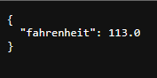
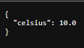

## Temperature Converter
This is a simple web application built using Flask that allows users to convert temperatures between Celsius and Fahrenheit. Users can input a temperature in either Celsius or Fahrenheit, and the application will convert it to the other temperature unit.

## Installation and Usage
To use the Temperature Converter, you will need to have Python and Flask installed on your computer.

- Clone this repository to your local machine
- Open a terminal and navigate to the project directory
- Run the command python app.py to start the Flask server
- Open a web browser and navigate to http://localhost:5000
- Enter a temperature in either Celsius or Fahrenheit and click the corresponding button to convert it to the other temperature unit

## Dependencies
This application requires the following dependencies:

Flask 2.1.0 or later

## License
This application is released under the MIT License.

## Screen shots

- Home

- celsius-to-fahrenheit

- fahrenheit-to-celsius

